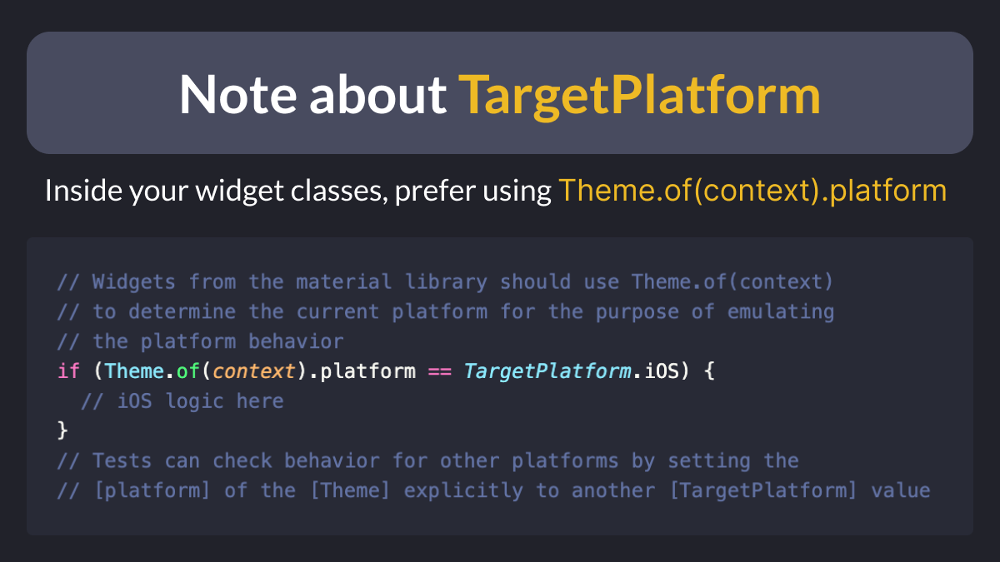

# The UniversalPlatform Package

Did you know?

If your code checks the current platform with [`Platform.isIOS`](https://api.flutter.dev/flutter/dart-io/Platform-class.html), you’ll get a runtime exception when you run on Flutter web. 💥

As an alternative, you can use the [Universal Platform](https://pub.dev/packages/universal_platform) package, which works on all platforms and offers a unified syntax.

<!--
// 💥💥💥 will explode on web 💥💥💥
if (Platform.isIOS) {
  // iOS logic here      
}

// Better, but ugly
if (!kIsWeb && Platform.isIOS) {
  // iOS logic here      
}

// Cleaner and more robust
if (UniversalPlatform.isIOS) {
  // iOS logic here      
}
-->

---

Note that the [`UniversalPlatform`](https://pub.dev/documentation/universal_platform/latest/universal_platform/UniversalPlatform-class.html) class has two drawbacks:

- It doesn't (yet) support tree-shaking of the conditional code (see [issue #29](https://github.com/gskinnerTeam/flutter-universal-platform/issues/29) for details)
- The platform can't be overridden during testing (see [issue #15](https://github.com/gskinnerTeam/flutter-universal-platform/issues/15) for details)

If you don't want to rely on a 3rd party package to perform platform checks, see my next tip about `defaultTargetPlatform` and `kIsWeb`.

<!--
One drawback of the [`Platform`](https://api.flutter.dev/flutter/dart-io/Platform-class.html) and [`UniversalPlatform`](https://pub.dev/documentation/universal_platform/latest/universal_platform/UniversalPlatform-class.html) classes is that you can't override the platform for testing purposes.

To work around that, use `Theme.of(context).platform` in your widgets and supply a `ThemeData` with a different platform in your test setup code.

// Widgets from the material library should use Theme.of(context)
// to determine the current platform for the purpose of emulating
// the platform behavior
if (Theme.of(context).platform == TargetPlatform.iOS) {
  // iOS logic here
}
// Tests can check behavior for other platforms by setting the
// [platform] of the [Theme] explicitly to another [TargetPlatform] value

More info here: [ThemeData.platform property](https://api.flutter.dev/flutter/material/ThemeData/platform.html)

-->

---

| Previous | Next |
| -------- | ---- |
| [Taking screenshots with the Flutter CLI](../0163-flutter-screenshot/index.md) | [Use defaultTargetPlatform and kIsWeb](../0165-default-target-platform/index.md)  |

<!-- TWITTER|https://x.com/biz84/status/1800520573346566582 -->
<!-- LINKEDIN|https://www.linkedin.com/posts/andreabizzotto_did-you-know-if-your-code-checks-the-current-activity-7206286803283161088-CJB3 -->