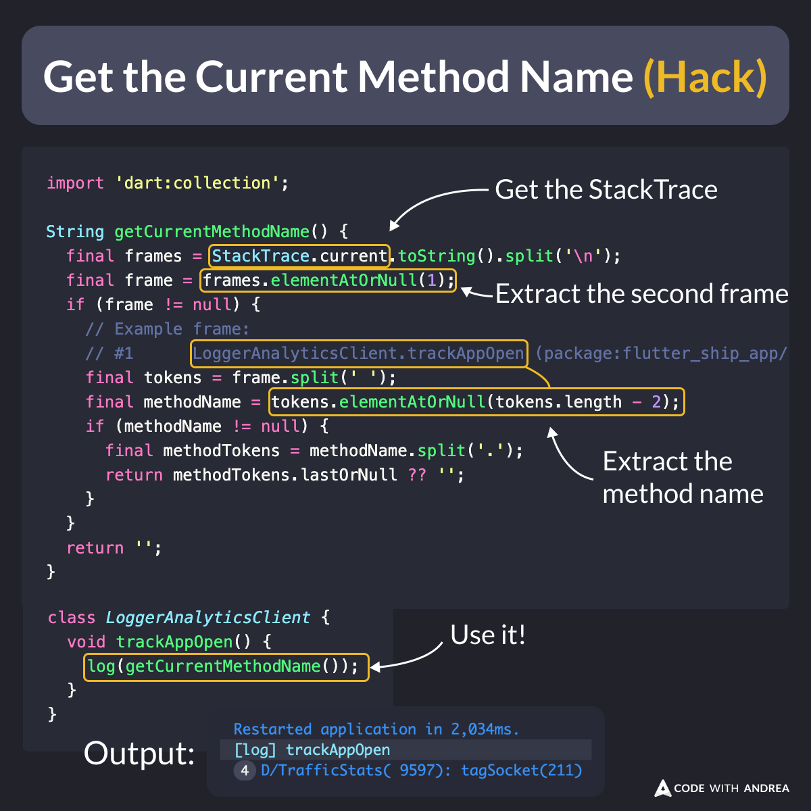

# Get the Current Method Name (Hack)


Did you know?

By doing some string manipulation on the current stack trace, you can extract the current method name.

This is useful with logging or analytics code, where similar methods may be invoked.



<!--

import 'dart:collection';

String getCurrentMethodName() {
  final frames = StackTrace.current.toString().split('\n');
  final frame = frames.elementAtOrNull(1);
  if (frame != null) {
    // Example frame:
    // #1      LoggerAnalyticsClient.trackAppOpen (package:flutter_ship_app/src/monitoring/logger_analytics_client.dart:28:9)
    final tokens = frame.split(' ');
    final methodName = tokens.elementAtOrNull(tokens.length - 2);
    if (methodName != null) {
      final methodTokens = methodName.split('.');
      return methodTokens.lastOrNull ?? '';
    }
  }
  return '';
}

class LoggerAnalyticsClient {
  void trackAppOpen() {
    log(getCurrentMethodName());
  }
}

// Output:
// Restarted application in 2,034ms.
// [log] trackAppOpen
// 4 D/TrafficStats( 9597): tagSocket(211)

-->

---

### Example code

Note that the code above is a bit fragile and doesn't work well with extension methods or closures, where the stack frames look a bit different.

Here's a more refined and robust example that works better with closures:

```dart
/// Helper function to extract the current method name from the stack trace
String getCurrentMethodName() {
  final frames = StackTrace.current.toString().split('\n');
  // The second frame in the stack trace contains the current method
  final frame = frames.elementAtOrNull(1);
  if (frame != null) {
    // Extract the method name from the frame. For example, given this input string:
    // #1      LoggerAnalyticsClient.trackAppOpen (package:flutter_ship_app/src/monitoring/logger_analytics_client.dart:28:9)
    // The code will return: LoggerAnalyticsClient.trackAppOpen
    final tokens = frame
        .replaceAll('<anonymous closure>', '<anonymous_closure>')
        .split(' ');
    final methodName = tokens.elementAtOrNull(tokens.length - 2);
    if (methodName != null) {
      // if the class name is included, remove it, otherwise return as is
      final methodTokens = methodName.split('.');
      // ignore_for_file:avoid-unsafe-collection-methods
      return methodTokens.length >= 2 &&
              methodTokens[1] != '<anonymous_closure>'
          ? (methodTokens.elementAtOrNull(1) ?? '')
          : methodName;
    }
  }
  return '';
}
```

In any case, this is just a hack:

- It's slow, so don't use it in hot code paths (like loops)
- It won't work if you enable obfuscation 

So, if you want to use it, make sure it's enabled on **debug builds only**. 

---

| Previous | Next |
| -------- | ---- |
| [Hugeicons (4,000 stroke Flutter icons)](../0173-hugeicons-flutter-stroke-icons/index.md) |  |

<!-- TWITTER|https://x.com/biz84/status/1815754159666176419 -->
<!-- LINKEDIN|https://www.linkedin.com/posts/andreabizzotto_did-you-know-by-doing-some-string-manipulation-activity-7221520196753133568-fGId  -->


