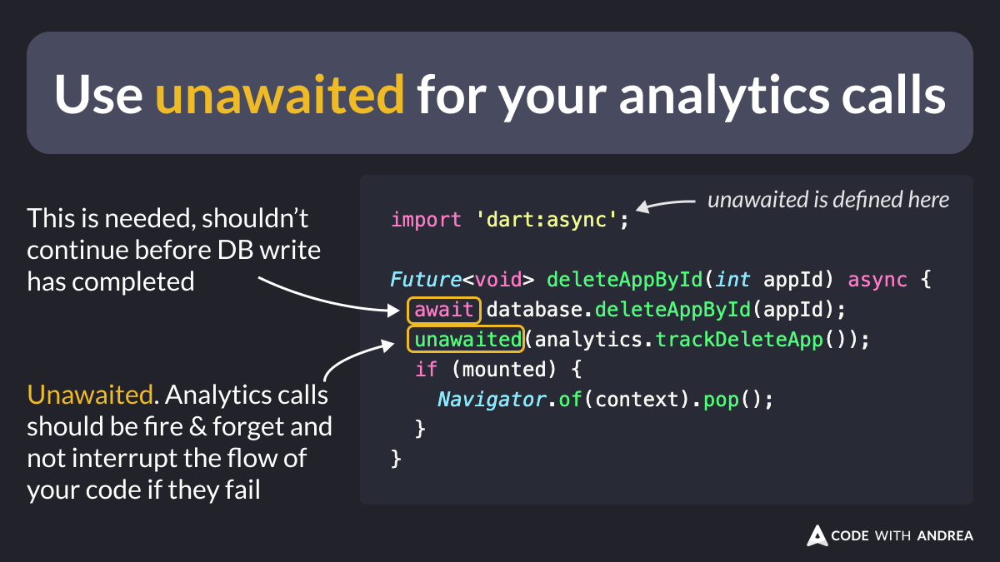

# Use unawaited for your analytics calls

When tracking analytics events in your code, consider using `unawaited()` from `dart:async`.

This makes it explicit that your code shouldn't wait for the Future to return or be interrupted if it fails (most analytics SDKs automatically retry in case of failure).

<!--
// Use unawaited for your analytics calls
import 'dart:async';

Future<void> deleteAppById(int appId) async {
  await database.deleteAppById(appId);  
  unawaited(analytics.trackDeleteApp());
  if (mounted) {
    Navigator.of(context).pop();
  }
}
-->

---

| Previous | Next |
| -------- | ---- |
| [How to use --dart-define-from-file with .env and json files](../0175-dart-define-from-file-env-json/index.md) |  |