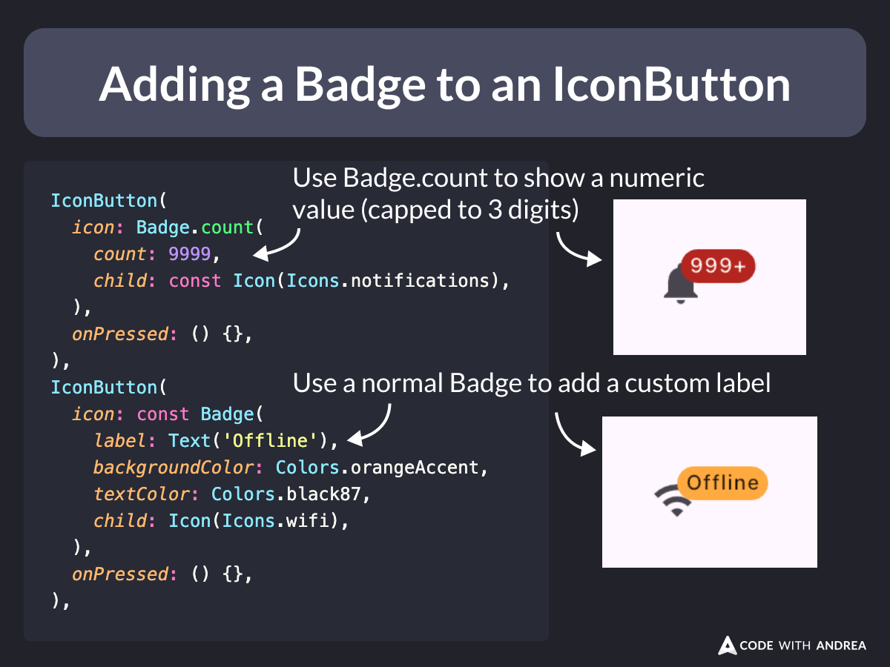

# Adding a Badge to an IconButton

Did you know?

The easiest way to add a badge to an [`IconButton`](https://api.flutter.dev/flutter/material/IconButton-class.html) is to use the [`Badge`](https://api.flutter.dev/flutter/material/Badge-class.html) widget.

Use cases:

- show a notification count 🔔
- show a custom label 🏷️

Works great with [`BottomNavigationBarItem`](https://api.flutter.dev/flutter/widgets/BottomNavigationBarItem-class.html) and [`NavigationRailDestination`](https://api.flutter.dev/flutter/material/NavigationRailDestination-class.html), too. 👍

<!--
A graphic titled "Adding a Badge to an IconButton" shows two examples of how to use badges in Flutter. The first example highlights using Badge.count to display a numeric value, capped at 3 digits, on a notification bell icon. The code snippet demonstrates setting the count to 9999, which is displayed as "999+" on the badge. The second example shows how to use a normal Badge widget to add a custom label to a Wi-Fi icon. The code snippet illustrates setting the label to "Offline" with an orange background and black text. Both examples are displayed visually alongside their corresponding code.

Code: 
IconButton(
  icon: Badge.count(
    count: 9999,
    child: const Icon(Icons.notifications),
  ),
  onPressed: () {},
),
IconButton(
  icon: const Badge(
    label: Text('Offline'),
    backgroundColor: Colors.orangeAccent,
    textColor: Colors.black87,
    child: Icon(Icons.wifi),
  ),
  onPressed: () {},
),
-->

---

For more info about `Badge`, read:

- [Badge class](https://api.flutter.dev/flutter/material/Badge-class.html)

---

| Previous | Next |
| -------- | ---- |
| [Detect triple taps with RawGestureDetector](../0184-triple-tap-detector/index.md) |  |

<!-- TWITTER|https://x.com/biz84/status/1830588928874663981 -->
<!-- LINKEDIN|https://www.linkedin.com/posts/andreabizzotto_did-you-know-the-easiest-way-to-add-a-badge-activity-7236355192022077442-xejp  -->

