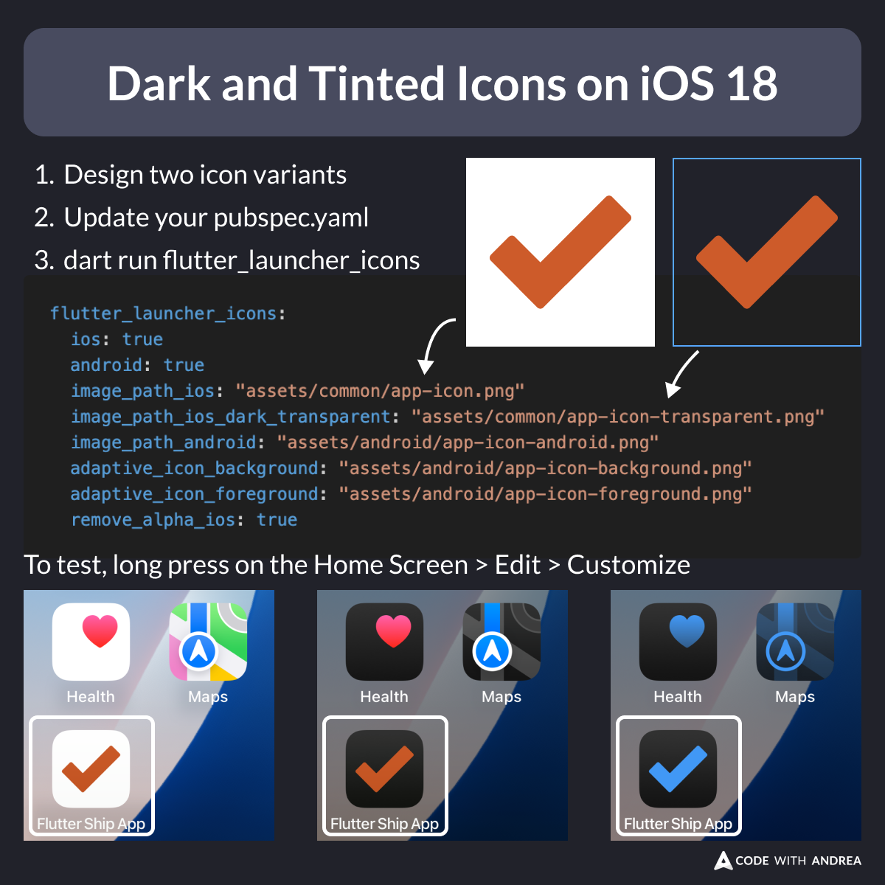

# Dark and Tinted Icons on iOS 18

Did you know?

iOS 18 supports dark and tinted icons.

To enable this in your Flutter app:

- Add one icon variant with transparency
- Install and configure `flutter_launcher_icons` in your `pubspec.yaml`
- Run `dart run flutter_launcher_icons`

Then, run the app and join the dark side! 🌚

<!--

Design two icon variants
Update your pubspec.yaml
dart run flutter_launcher_icons

flutter_launcher_icons:
  ios: true
  android: true
  image_path_ios: "assets/common/app-icon.png"
  image_path_ios_dark_transparent: "assets/common/app-icon-transparent.png"
  image_path_android: "assets/android/app-icon-android.png"
  adaptive_icon_background: "assets/android/app-icon-background.png"
  adaptive_icon_foreground: "assets/android/app-icon-foreground.png"
  remove_alpha_ios: true

To test, long press on the Home Screen > Edit > Customize

-->

---

Following all the app icon guidelines on iOS and Android can be tricky.

To make life easier, my new course includes a whole module about launcher icons and splash screens.

If you're interested, check it out here:

- [Flutter in Production](https://codewithandrea.com/courses/flutter-in-production/)

---

| Previous | Next |
| -------- | ---- |
| [FlutterFire Config with Multiple Flavors (Shell Script)](../0196-flutterfire-config-multiple-flavors/index.md) | [Show the Licenses in your Flutter app](../0198-show-licenses-flutter-app/index.md) |

<!-- TWITTER|https://x.com/biz84/status/1844641248436466057 -->
<!-- LINKEDIN|https://www.linkedin.com/posts/andreabizzotto_did-you-know-ios-18-supports-dark-and-tinted-activity-7250407163200729088-bDdF -->
