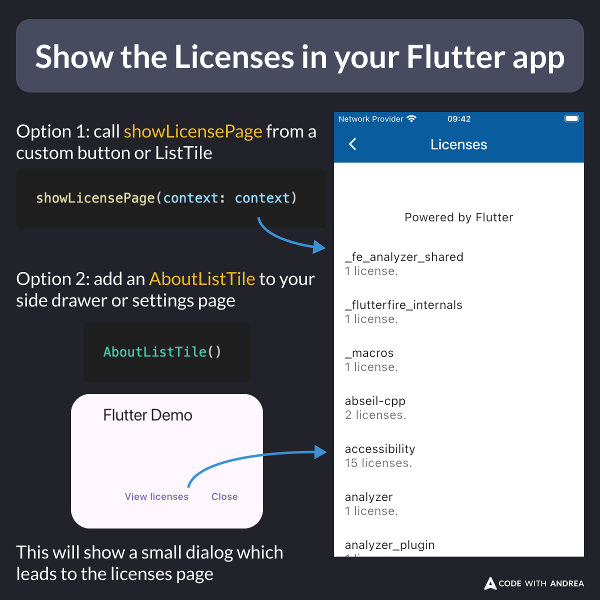

# Show the Licenses in your Flutter app

Did you know?

Your Flutter app should show the licenses for packages in use. This is often a legal requirement, as many open-source licenses require attribution.

To do this, you have two options:
- call the [showLicensePage](https://api.flutter.dev/flutter/material/showLicensePage.html) API directly
- use the [AboutListTile](https://api.flutter.dev/flutter/material/AboutListTile-class.html) widget

<!-- 
Show the Licenses in your Flutter app

Option 1: call showLicensePage from a custom button or ListTile

Option 2: add an AboutListTile to your side drawer or settings page
-->

---

Note that the [showLicensePage](https://api.flutter.dev/flutter/material/showLicensePage.html) function displays licenses for all the packages your app depends on, including transitive dependencies.

The large number of licenses is expected since even a few direct dependencies can pull in many others.

---

You can also use a more custom approach and get the raw licenses from the [LicenseRegistry](https://api.flutter.dev/flutter/foundation/LicenseRegistry-class.html) class.

For more details, read:

- [How can I determine the licenses my Flutter application needs to show?](https://docs.flutter.dev/resources/faq#how-can-i-determine-the-licenses-my-flutter-application-needs-to-show)

---

To learn more about how to get your app ready for production, check my latest course:

- [Flutter in Production](https://codewithandrea.com/courses/flutter-in-production/)

---

| Previous | Next |
| -------- | ---- |
| [Dark and Tinted Icons on iOS 18](../0197-dark-tinted-icons-ios-18/index.md) | [Force Update with Remote Config](../0199-force-update-helper/index.md) |

<!-- TWITTER|https://x.com/biz84/status/1845753055347704182 -->
<!-- LINKEDIN|https://www.linkedin.com/posts/andreabizzotto_did-you-know-your-flutter-app-should-show-activity-7251518989489573888-TDgc -->
