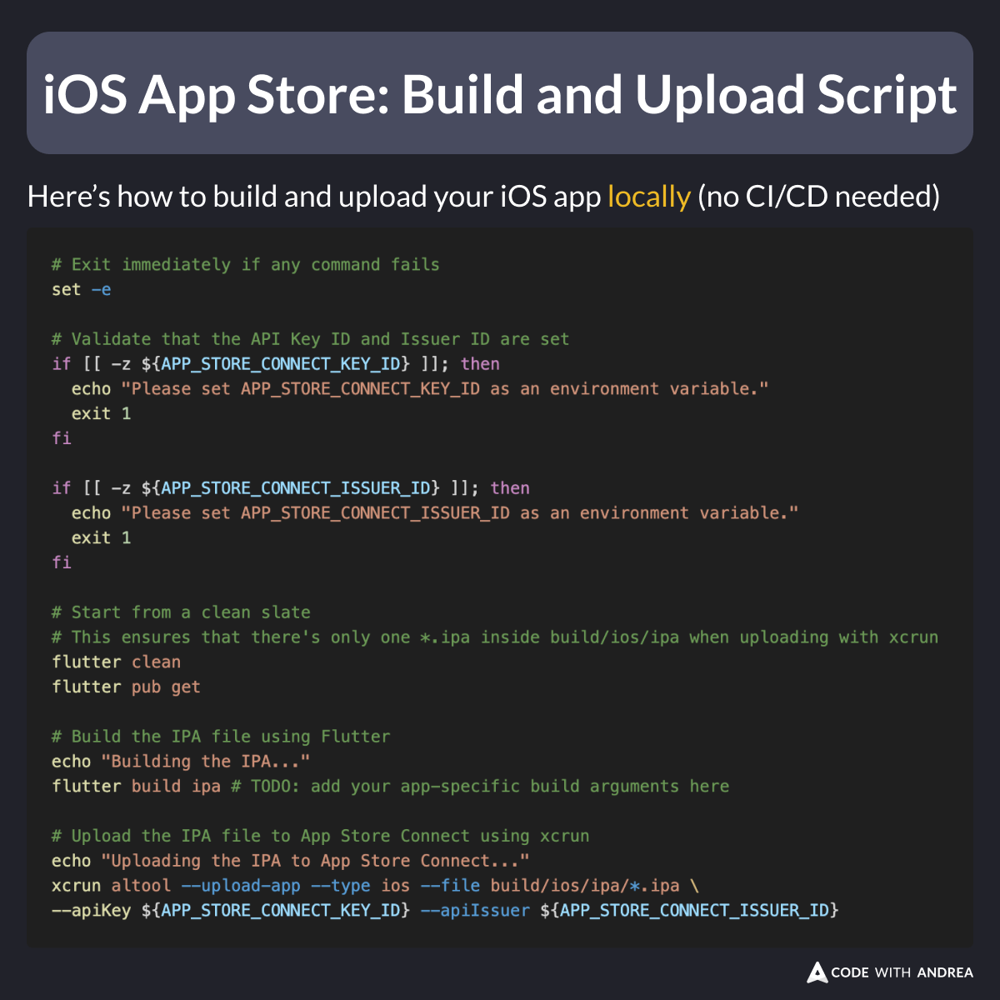

# iOS App Store: Build and Upload Script

Did you know?

With this simple script, you can build and upload your iOS app to App Store Connect.

The best thing? You can run it from your local machine (no CI/CD needed!)

Read below for instructions on how to get it working. 🧵

<!--
# Exit immediately if any command fails
set -e

# Validate that the API Key ID and Issuer ID are set
if [[ -z ${APP_STORE_CONNECT_KEY_ID} ]]; then
  echo "Please set APP_STORE_CONNECT_KEY_ID as an environment variable."
  exit 1
fi

if [[ -z ${APP_STORE_CONNECT_ISSUER_ID} ]]; then
  echo "Please set APP_STORE_CONNECT_ISSUER_ID as an environment variable."
  exit 1
fi

# Start from a clean slate
# This ensures that there's only one *.ipa inside build/ios/ipa when uploading with xcrun
flutter clean
flutter pub get

# Build the IPA file using Flutter
echo "Building the IPA..."
flutter build ipa # TODO: add your app-specific build arguments here

# Upload the IPA file to App Store Connect using xcrun
echo "Uploading the IPA to App Store Connect..."
xcrun altool --upload-app --type ios --file build/ios/ipa/*.ipa \
--apiKey ${APP_STORE_CONNECT_KEY_ID} --apiIssuer ${APP_STORE_CONNECT_ISSUER_ID}
-->

---

The script uses the xcrun command line tool to upload the IPA to App Store Connect.

You’ll need to authenticate with one of these methods:

- Username and Password 
- App Store Connect API Key (recommended)

This guide explains how to obtain an API key:

- [Creating API Keys for App Store Connect API](https://developer.apple.com/documentation/appstoreconnectapi/creating-api-keys-for-app-store-connect-api)

---
Once you have obtained your Key ID and Issuer ID, set them as environment variables in your system (I like to store mine in `~/.zshrc` for convenience.)

Then, simply download the script and use it. 👍

- [Simple script to build and upload the IPA file to App Store Connect](https://gist.github.com/bizz84/0a00a48dce7982cf3b3cc59c940ee344)

---

My latest course, [Flutter in Production](https://codewithandrea.com/courses/flutter-in-production/), covers the entire iOS app release process in detail—from joining the Apple Developer Program to submitting your app for review.

Here’s a free lesson to get started:

- [Intro: Releasing Your iOS App to the App Store](https://pro.codewithandrea.com/flutter-in-production/09-release-ios/01-intro)

---

| Previous | Next |
| -------- | ---- |
| [API keys storage: Client or Server?](../0208-api-keys-client-server/index.md) |  |

---

<!-- TWITTER|https://x.com/biz84/status/1861378082013073495 -->
<!-- LINKEDIN|https://www.linkedin.com/posts/andreabizzotto_did-you-know-with-this-simple-script-you-activity-7267144848770490368-KboJ -->
<!-- BLUESKY|https://bsky.app/profile/codewithandrea.com/post/3lbty7cjgdk2v -->
